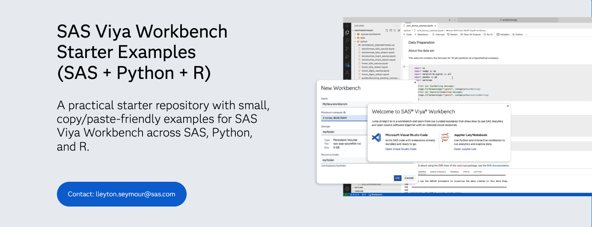

# SAS Viya Workbench Starter Examples (SAS + Python + R)
## Overview

A practical starter repository with small, copy/paste-friendly examples for SAS Viya Workbench across SAS, Python, and R.
Use this repo to learn the basics of running code, using notebooks, and building repeatable workflows.

### Prerequisites

An active SAS Viya Workbench license and environment

### Installation

Start SAS® Viya® Workbench and clone the examples repository into the root of your workspace:

`git clone https://github.com/lleytonse/workbench-starter-code.git`

### Quick Resource Links
- [Workbench Documentation](https://go.documentation.sas.com/doc/en/workbenchcdc/v_001/workbenchwlcm/home.htm?fromDefault=)
- [Getting Started Video (Youtube)](https://www.youtube.com/watch?v=BkjmQMXfpJU&t=57s)
- [List of Common PROCs](https://go.documentation.sas.com/doc/en/workbenchcdc/v_001/workbenchprocs/n1xot8d31pfd0in1puiry6rhrum8.htm)
- [SAS Communities Articles](https://communities.sas.com/t5/SAS-Viya-Workbench/ct-p/viya-workbench)
- [Workbench Quick Start Videos](https://communities.sas.com/t5/SAS-Viya-Workbench-Getting/tkb-p/viya-workbench-get-started)


## License & Data

SAS provides more than 200 data sets in the Sashelp library. These data sets are available for you to use for examples and for testing code. For example, the following step uses the Sashelp.LeuTrain data set:

```sas
title 'Leukemia Training Data';
proc contents data=sashelp.LeuTrain varnum;
   ods select position;
run;
```

You do not need to provide a DATA step to use Sashelp data sets.

The following steps list all the data sets that are available in Sashelp:

```sas
ods select none;
proc contents data=sashelp._all_;
   ods output members=m;
run;
ods select all;

proc print;
   where memtype = 'DATA';
run;
```


## Contact

- Lleyton Seymour (lleyton.seymour@sas.com)


## Change Log

- Version 1.0.0 (04FEB2026)
  - Initial release on GitHub